## Hi y'all! I'm Muhammad Adilaga👋

🎓 Informatics Engineering Student
💻 Interested in Software Development & Technology 
🌱 Currently learning and building new projects

  

 

## 👨‍💻 About Me

I'm an **Informatics Engineering student** with an interest in **software development and technology**.

- 🎓 Studying Informatics Engineering
- 💻 Exploring software development and modern technologies
- 🌱 Learning by building projects and experimenting with new ideas
- 🚀 Continuously improving my programming and problem-solving skills

## 🛠️ Tech Stack

### Languages

  

### Web Technologies

  

### Tools & Database

  

## 📊 GitHub Stats

  
  

## 🚀 Featured Projects

<table>
<tr>
<td width="50%" valign="top">

### 🛡️ Bareskrim Recruitment System

A **full-stack recruitment and online examination platform** built for a Roblox roleplay community.

Features Roblox identity verification, cross-group validation, server-side auto-grading, exam attempt control, admin settings, and real-time Discord reporting.

**Tech Stack:**  
`Next.js` `React` `TypeScript` `Tailwind CSS` `PostgreSQL` `Prisma`

<a href="https://github.com/muhadilaga/bareskrim-rekrutmen">
  <strong>View Repository →</strong>
</a>

</td>

<td width="50%" valign="top">

### 📐 Bangun Datar

A program for calculating the **area and perimeter of geometric shapes**, built while practicing programming fundamentals and mathematical logic.

<a href="https://github.com/muhadilaga/Menghitung-Luas-dan-Keliling-Bangun-Datar">
  <strong>View Repository →</strong>
</a>

</td>
</tr>

<tr>
<td width="50%" valign="top">

### 💵 Pecahan Uang

A program that breaks monetary values into **currency denominations**, created to practice algorithms, conditions, and basic programming logic.

<a href="https://github.com/muhadilaga/pecahan-uang">
  <strong>View Repository →</strong>
</a>

</td>

<td width="50%" valign="top">

### 🚧 More Projects

More projects are coming as I continue learning, experimenting, and building.

</td>
</tr>
</table>

## 📫 Connect With Me

  
  
  

I'm always open to learning, collaboration, and connecting with fellow developers.  
Feel free to explore my repositories and follow my journey as I continue building and improving my skills.

---

  

